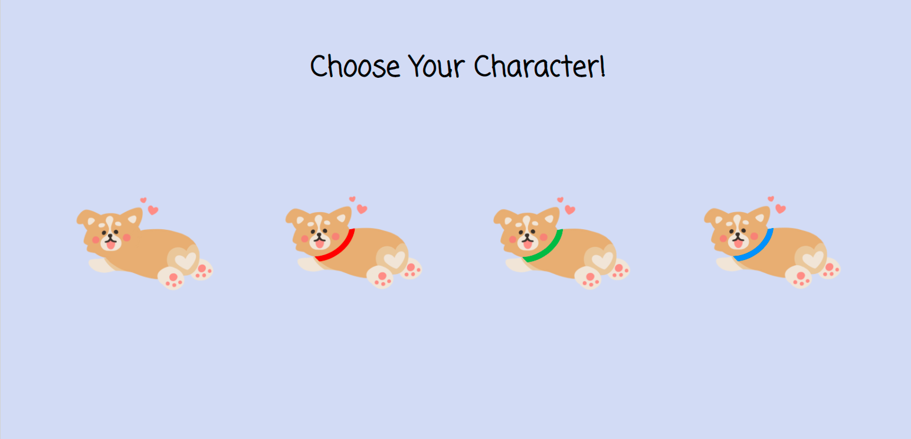
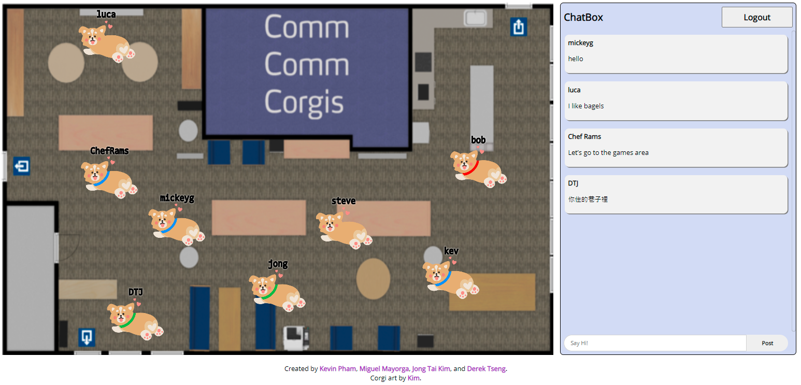
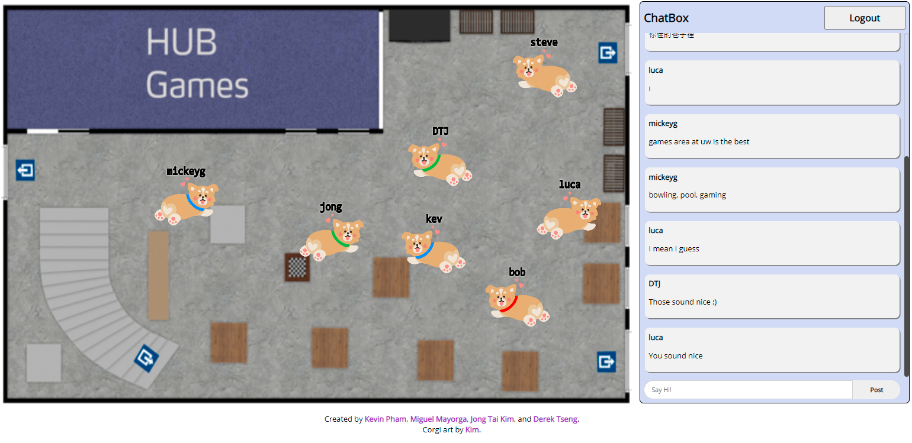

# Comm Comm Corgis

Created by
<a class="link-formatter" href="https://kevinknpham.github.io/" target="_blank"
              >Kevin Pham</a
            >,
<a class="link-formatter" href="https://github.com/mickeygcodes" target="_blank"
              >Miguel Mayorga</a
            >,
<a class="link-formatter" href="https://github.com/warandstar" target="_blank"
              >Jong Tai Kim</a
            >, and
<a class="link-formatter" href="https://github.com/DTJ357" target="_blank">
Derek Tseng</a
            >.

Corgi art by
<a class="link-formatter" href="https://www.etsy.com/shop/shopkimmysaur" target="_blank"
              >Kim</a
            >.

Comm Comm Corgis is inspired by the legendary Club Penguin but with corgis and the locations inspired by the University of Washington Seattle campus!

Comm Comm Corgis is intended to recreate the Comm Comm (Commuter Commons) experience for UW (University of Washington) students who are currently unable to fully engage with the UW Seattle community due to the COVID-19 pandemic.





## Setup

To set up the server locally, run the following:

```shell
npm i && npm start
```

## Live Demo

A live demo is currently being hosted on [Heroku](https://comm-comm-corgis.herokuapp.com/).

### To be fixed:

There is issue with PC resolution scale. Works best with 100% and 125%. 

We recommend users to have 16:9 monitor. 

## Features

Comm Comm Corgis was created as a proof of concept. In this demo, we have the following features:

- Responsive UI
- Mouse-based character navigation
- 8 unique rooms
- Chat box
- Character selection
